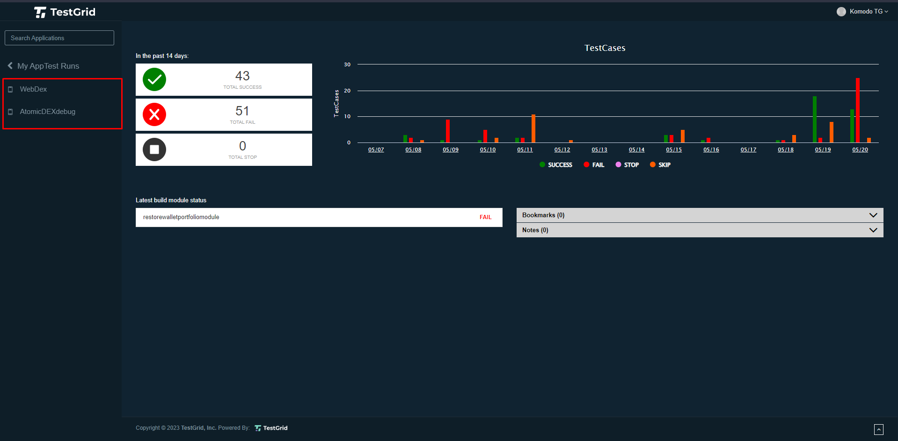
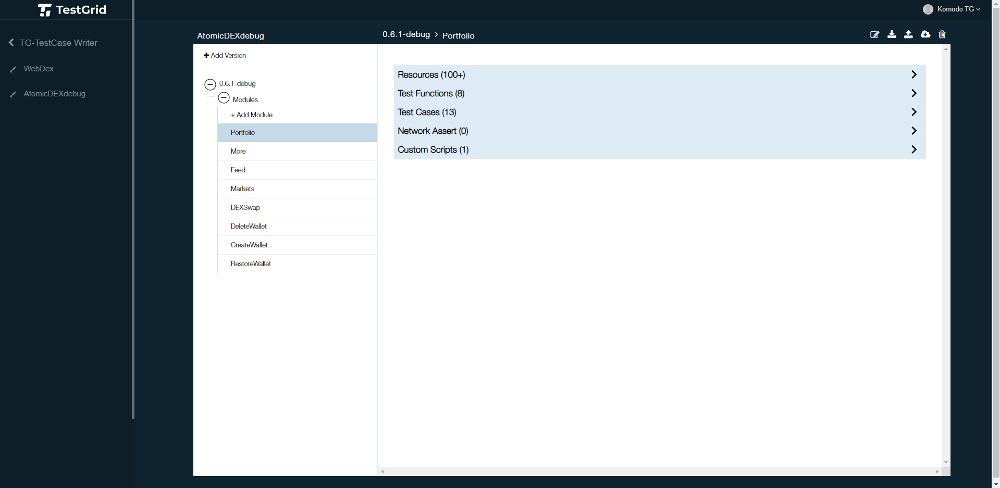
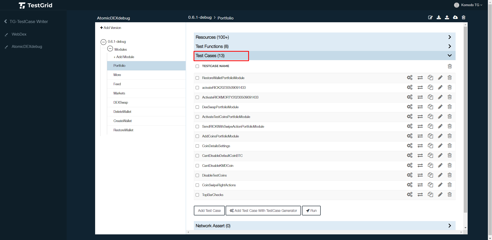
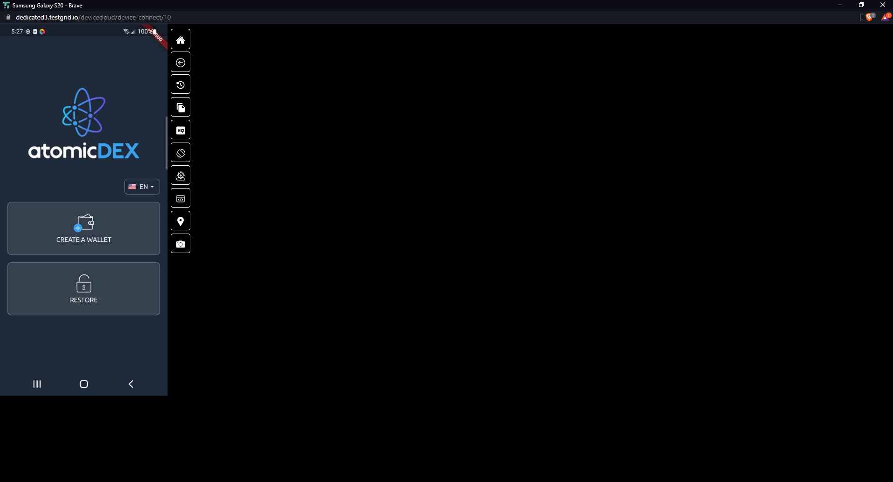
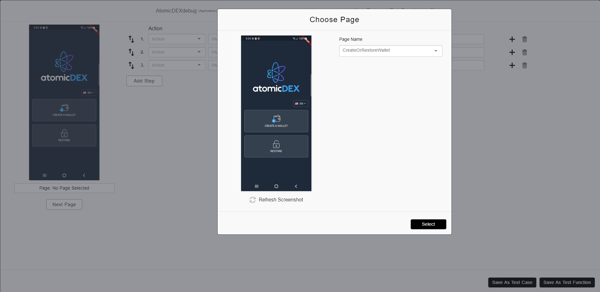
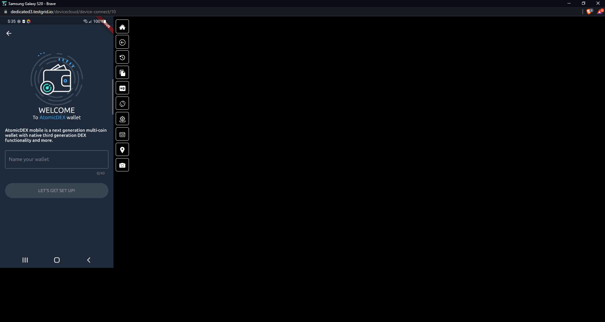
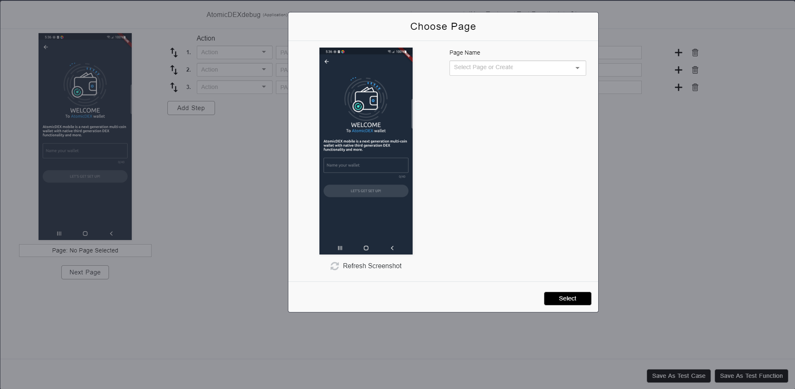
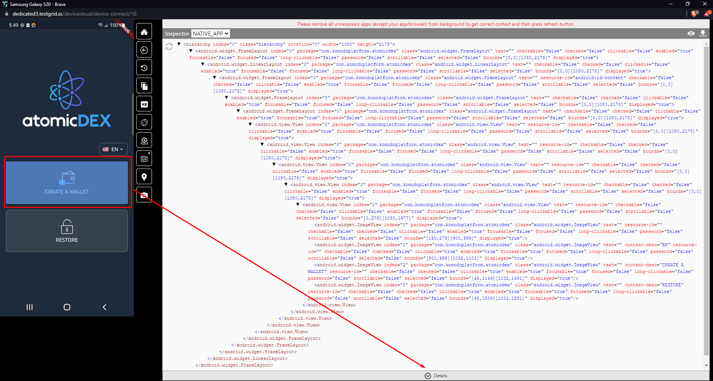

# Test Grid Documentation 
   ## 1. Go to Application
   - Open [TestGrid](https://dedicated3.testgrid.io/) Website.
   - Login with the correct credential.
   - Click **Application**.
   - It will take you to the dashboard.

   ## 2. Choose Application

   
   - Choose one of the applications as listed in the image above or for how to __add new application__ [check here](https://www.testgrid.io/docs/test-case-versioning-management).

   ## 3. Write test cases
   
   - After choosing the app you want to work on, this page will appear:
     
     
   - Click on __TG-TestCase Writer__.
   - After that wait for a few moments for this page to appear:
     
     
   - Here are a few explanations about sections in this page:

     
      - Version: basically is the app version that we want to test, in this case 0.6.1 AtomicDex.
      - Modules: Every module that we want to test, here are listed AtomicDex modules, and the test cases are based on AtomicDex test plan.
      - Test cases and test functions are everything user has to focus on.
      - For more information please vist Test Grid [documentation](https://www.testgrid.io/docs/document/category/documentation/automation-testing)
   
   ## 4. Generate Test Cases

   - To start generating test cases, first have to expand __Test Cases__:
     
     
   - After that you will find a list of test cases.
   - Click on __Add Test Case With TestCase Generator__:
     
     
   - At that moment please click on user profile at top right in the page, and click __TG-DeviceCloud__
     
     
   - After that a new tab will be open, and you will find a list of devices:

     
   - The device will be ready to generate test cases at the moment when the button it will have the description: __Available (TC Generator)__ and then tap __Connect__.

     
   - A new browser tab will be opened, and it will look like this: 
     
     
   - Also, this page it will be visible at the tab we initiated the test case generator, so go back there and you will find this view:

     
   - In this case just select the page for example: __CreateOrRestoreWallet__ and tap select.
   - Then you will be ready to write test cases.

   ## 5. How to catch elements in Test Grid

   - First of all everything that the user do in the device cloud, interacts with application, for example the user tap __CREATE WALLET__
     we except this view it will be visible:

     
   - After this we have to go back at test case generator windows, tap __Refresh Screenshot__ and this will be visible:

     
   - For more tutorials and how to there are a lot of [videos](https://www.youtube.com/@testgridno-codetestautomat7285/playlists) from test grid trainers who explain better those steps.
   - For catching elements better there is a better way than Test Grid automatic catchers:
     
     - Go back to Device Cloud where application is up and running.
     - Tap this icon, it is for inspection element:
       
       
     - For example we want to tap __CREATE WALLET__ element, but first we have to catch it as an element.
     - Surf through the elements till the __CREATE WALLET__ element will be highlighted:
     
       
     - After that tap __Details__:
     
       
     - There you will find all the details about the __CREATE WALLET__ element.
     - Then go back to Test case generator page, create a step to tap to an element, click select element, and configure it to choose the element manually:
     
       
     - At the __By Full XPath__ write down: `//android.widget.ImageView@content-desc[contains(., "CREATE WALLET")]` and save, do not forget to name the element.
     - Basically that is the safest way to do the catch of elements in Test Grid, you can use it in whatever way you want, but be aware that there are cases that after running the tests it will not be known as the element that was grabbed automatically by TestGrid.
   

